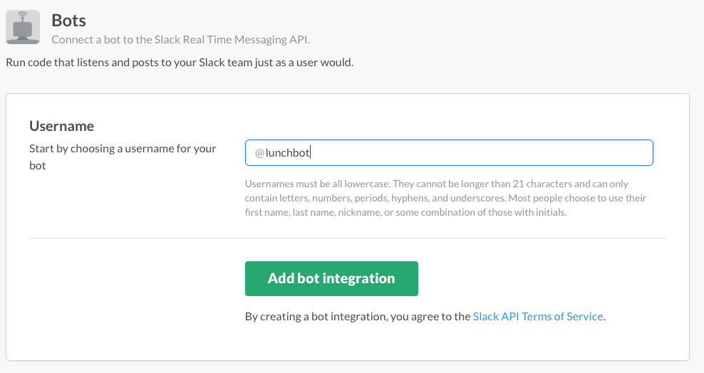

# LunchBot

LunchBot is a simple Slack bot to find lunch.

# Getting Started
Requires Ruby 2.3.x

* Fork this repo or press the deploy to Heroku button below.
* Set up your `.env`. Take a look at `Environment Variables`.
* `bundle install`
* `bundle exec ruby lunch_bot.rb`

# How to use

Once the app is running, you'll need to set up a SlackBot.

Create a new Bot Integration under [services/new/bot](http://slack.com/services/new/bot).

On the next screen, note the API token.

Invite lunchbot (or whatever you named your bot) to a channel. Any time someone mentions food or lunch, lunchbot will provide a place to eat.

## Commands

Currently LunchBot is very basic but accepting PR's!

Some examples:

* `lunchbot food`
* `lunchbot lunch`
* lunchbot will also be invoked it `food` or `lunch` is found in any sentence. - TODO: Add env var to disable this
* You can also set the location to search.
  * `food location: 32828`
  * `food location: 1234 Some Road, Orlando, FL`

# Environment Variables

There are a few variables the app will require. You can take a look at the `.env.example` for an example of the available variables and how to set up your `.env`.
To set up the `.env`, touch a `.env` file, copy the contents of `.env.example` and fill it in with your information. You will need a [Slack API Token](http://slack.com/services/new/bot) and [Yelp Tokens](https://www.yelp.com/developers/manage_api_keys).

# Deploy to Heroku

